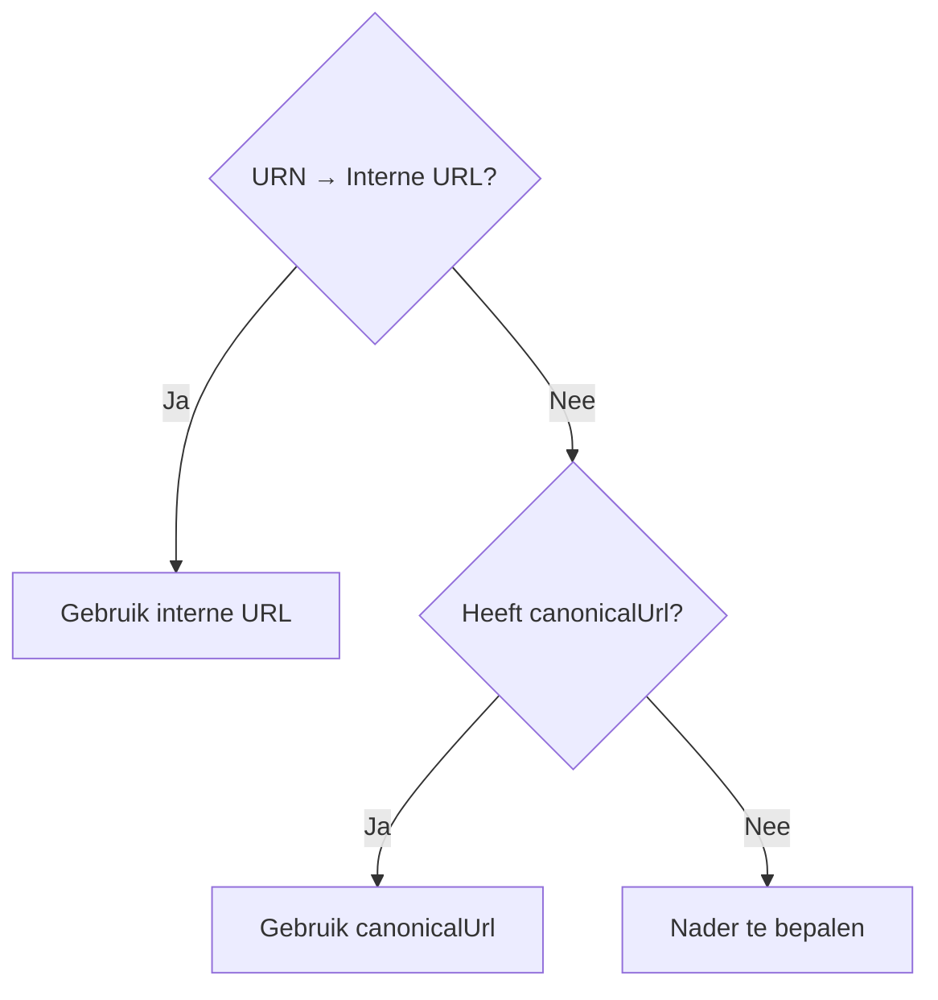

import Schema from "@theme/Schema";
import Heading from "@theme/Heading";

<Heading
  as={"h1"}
  className={"openapi__heading"}
  children={"ContextLink"}
>
</Heading>


De context waaraan de taak is gekoppeld (bijv. een zaak of product),
aangeduid met een **URN** en optioneel een **canonicalUrl**.

`canonicalUrl` is afwezig als de dienstverlener geen eigen portaal heeft
(bijv. bedrijfsonderdelen die geen eigen portaal hebben).

Portalen die de URN kunnen omzetten naar een interne URL doen dat;
`canonicalUrl` is dan irrelevant. Anders geldt: gebruik `canonicalUrl`
als die aanwezig is. Het type context is af te leiden uit de URN-structuur.




<Schema
  schema={{"type":"object","description":"De context waaraan de taak is gekoppeld (bijv. een zaak of product),\naangeduid met een **URN** en optioneel een **canonicalUrl**.\n\n`canonicalUrl` is afwezig als de dienstverlener geen eigen portaal heeft\n(bijv. bedrijfsonderdelen die geen eigen portaal hebben).\n\nPortalen die de URN kunnen omzetten naar een interne URL doen dat;\n`canonicalUrl` is dan irrelevant. Anders geldt: gebruik `canonicalUrl`\nals die aanwezig is. Het type context is af te leiden uit de URN-structuur.\n\n```mermaid\nflowchart TD\n    A{URN → Interne URL?} -->|Ja| B[Gebruik interne URL]\n    A -->|Nee| C{Heeft canonicalUrl?}\n    C -->|Ja| D[Gebruik canonicalUrl]\n    C -->|Nee| E[Nader te bepalen]\n```\n","required":["urn"],"properties":{"urn":{"type":"string","pattern":"^urn:","description":"Portaal-agnostische identifier van de context, in URN-formaat.","example":"urn:nl:gemeenten:zaak:2026-00042"},"canonicalUrl":{"type":"string","format":"uri","description":"Optionele URL naar de context in de omgeving van de dienstverlener.\nAfwezig als de dienstverlener geen eigen portaal heeft. Als aanwezig,\nbruikbaar als directe link voor portalen die de URN niet zelf omzetten.\nPortalen met eigen contextondersteuning kunnen deze URL negeren en een\ninterne URL opbouwen via de URN.\n","example":"https://portaal.gemeente.nl/zaken/2026-00042"}},"title":"ContextLink"}}
  schemaType={"response"}
>
  
</Schema>
            