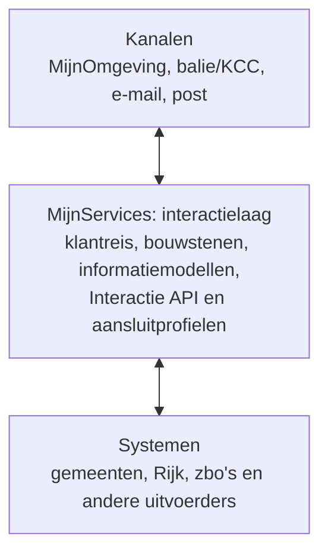

# MijnServices: betere dienstverlening

MijnServices maakt publieke dienstverlening begrijpelijk, proactief en
betrouwbaar. De [1-overheidsbeleving](https://www.digitaleoverheid.nl/overzicht-van-alle-onderwerpen/overheidsbrede-dienstverlening/loketfunctie-overheid/)
is het resultaat: actuele, eenduidige dienstverlening, via [elk kanaal](https://www.digitaleoverheid.nl/overzicht-van-alle-onderwerpen/overheidsbrede-dienstverlening/omnichannel-aanpak/).

## MijnServices standaardiseert de interactie met de overheid

MijnServices is de interactielaag tussen kanalen en uitvoerende systemen,
redenerend van buiten naar binnen. We standaardiseren niet op een mijnomgeving,
baliesysteem of zaaksysteem, maar op wat burgers en ondernemers willen weten,
doen of volgen.

De sectie [Klantreis en principes](./klantreis-en-principes/) beschrijft de
generieke klantroute en uitgangspunten. [Bouwstenen](./bouwstenen/)
en informatiemodellen definiëren de interactie en betekenis. De [Interactie API](./interactie-api/)
en [aansluitprofielen](./aansluitprofielen/) maken die herbruikbaar, in elk kanaal en met elk
bronsysteem.

## Eén overheidservaring, over kanalen heen

MijnServices werkt aan kanaalonafhankelijkheid: dezelfde actuele interactie,
ongeacht het uitvoerende systeem of het kanaal. Tegelijk werken we met de
kanalen aan een herkenbare en toegankelijke 1-overheidsbeleving.

We sluiten aan bij [NL Design System](https://nldesignsystem.nl/) en
[Gebruiker Centraal](https://www.gebruikercentraal.nl/), toetsen interacties in
de context van het kanaal en verwerken wat we leren in bouwstenen en
standaarden. Zo verbeteren kanaal en interactielaag elkaar, zonder dat elk
kanaal of systeem opnieuw dezelfde oplossing hoeft te ontwerpen.

## Waar begin ik?

| Rol                                                  | Start bij                                                     | Daarna                                                                                                    |
| ---------------------------------------------------- | ------------------------------------------------------------- | --------------------------------------------------------------------------------------------------------- |
| Service designer, beleidsmedewerker of product owner | [Klantreis en principes](./klantreis-en-principes/)           | Kies de interactietypen en bijpassende bouwstenen voor de klantreis.                                      |
| Functioneel ontwerper of informatiearchitect         | [Bouwstenen](./bouwstenen/)                                   | Werk de benodigde interacties en het functionele informatiemodel uit.                                     |
| Front-end developer                                  | [Kanaal: MijnOmgeving](./kanalen/mijn-omgeving/)              | Vertaal de bouwsteen naar toegankelijke schermen en sluit aan op het NL Design System.                    |
| Back-end- of API-developer                           | [Interactie API](./interactie-api/)                           | Implementeer de API-contracten en kies het passende [aansluitprofiel](./aansluitprofielen/) voor de bron. |
| Architect                                            | [Architectuur en standaarden](./architectuur-en-standaarden/) | Borg de samenhang tussen kanalen, interactielaag, standaarden en systemen.                                |
