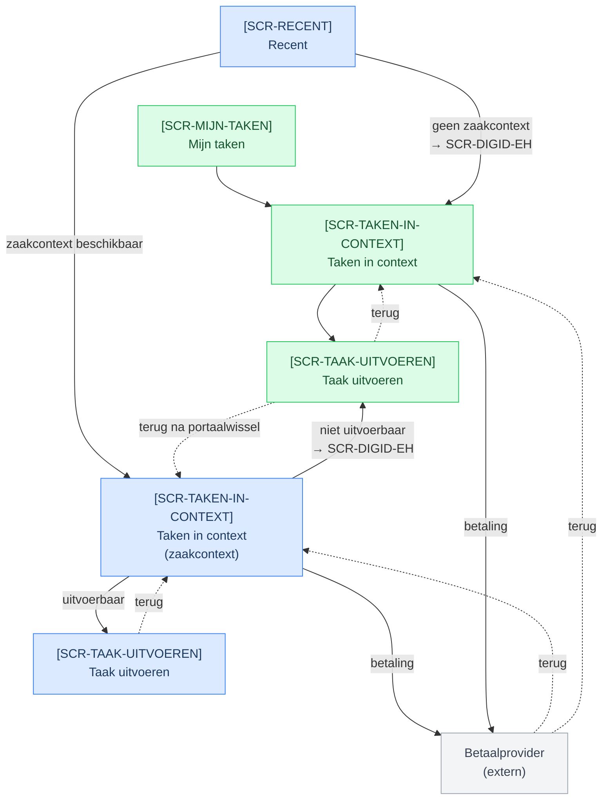
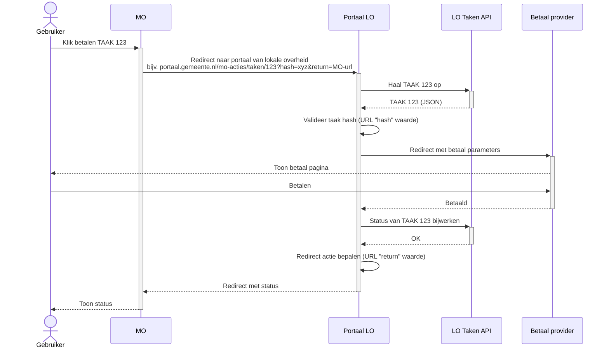
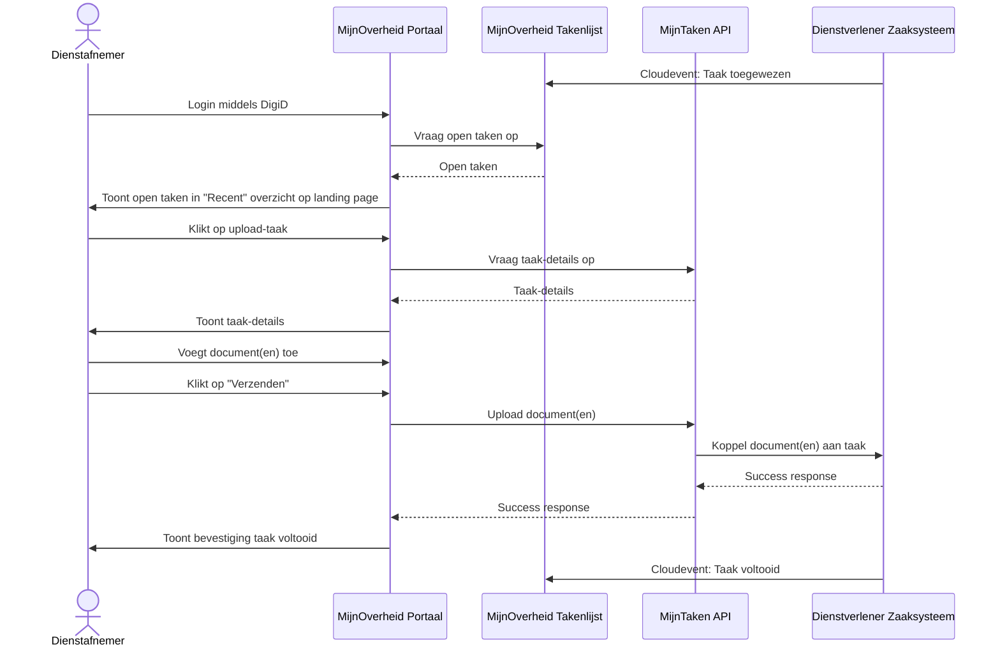

# Procesoverzicht

## Schermflow

Het onderstaande diagram toont de navigatieflow langs de [schermprofielen](../schermprofielen/) per startpunt en taaktype. **Blauw** is het beoogde pad voor MijnOverheid, **groen** voor MijnOmgeving. De betaalprovider (grijs) is extern en bereikbaar vanuit beide portalen.

:::note[Eerste versie]
Dit diagram is een eerste schets en wordt bijgehouden naarmate schermen en taaktypen zich ontwikkelen.
:::

## Technische uitvoeringsvoorbeelden

De functionele doelen en eisen staan bij
[UC-02 Taak afhandelen in MijnTaken](../bouwstenen/mijn-taken/index.md#uc-02-taak-afhandelen).
De onderstaande voorbeelden zijn overgenomen uit de eerdere use-case-uitwerking.
Ze beschrijven mogelijke technische samenwerking, geen verplicht kanaalpad of
vastgesteld API-contract.

:::note[Ontwerpvoorbeelden]
De voorbeelden zijn nog niet afgestemd op alle huidige schermprofielen en
API-operaties. Met name de betaalroute en lokale uploadondersteuning kunnen per
portaal verschillen. Gebruik de schermprofielen voor de actuele
portaaluitwerking en de Interactie API voor het contract.
:::

### Betaling via een andere omgeving

In dit voorbeeld gaat de gebruiker via een lokale omgeving naar een
betaalprovider. Na verwerking werkt de verantwoordelijke provider de
taakstatus bij. Terugkeer naar een portaal is op zichzelf geen bewijs dat de
betaling is geslaagd; het portaal moet de actuele uitkomst vaststellen.

### Documenten aanleveren via MijnOverheid

In dit voorbeeld levert de gebruiker documenten aan. De dienstverlener koppelt
die aan de dienstverlening en bevestigt de uitkomst. Het diagram veronderstelt
dat de betrokken omgeving uploaden ondersteunt; andere omgevingen kunnen de
gebruiker naar de uitvoerlocatie verwijzen.

