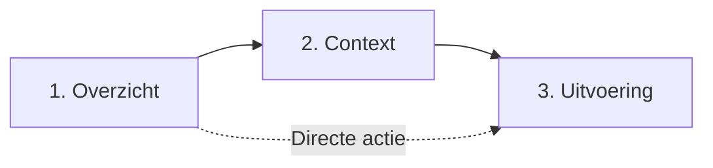

# Schermprofielen

Schermprofielen vertalen de abstracte bouwstenen (zoals Taken en Zaken) naar concrete interactiepatronen, UI-elementen, states en API-aanroepen binnen digitale overheidsportalen en apps.

Hiermee leggen schermprofielen het fundament voor een **1-overheidsbeleving**: of een inwoner nu inlogt op MijnOverheid, een gemeentelijk portaal of een uitvoeringsorganisatie, de manier waarop informatie wordt gepresenteerd en acties worden uitgevoerd is herkenbaar, begrijpelijk en consistent.

## NL Design System en Gebruiker Centraal

Schermprofielen zijn visuele producten die door inwoners en ondernemers direct worden gebruikt. Om herkenbaar en digitaal toegankelijk te zijn, maken we gebruik van de ontwerpprincipes en componenten van het [NL Design System](https://nldesignsystem.nl/) en de richtlijnen van [Gebruiker Centraal](https://www.gebruikercentraal.nl/).

Binnen de [MijnServices Community Sprint](https://nldesignsystem.nl/community/community-sprints/mijn-services-community/) werken diverse overheidsorganisaties samen aan de ontwikkeling van toegankelijke templates voor mijnomgevingen. Scherminteractie wordt met gebruikersonderzoek getoetst: pas als een interactiepatroon bewezen helder werkt voor inwoners, wordt het vertaald naar de specificaties van de onderliggende API's. De techniek volgt de interactie, niet andersom.

## De drie interactielagen

Om versnippering te voorkomen en te zorgen voor een logische navigatie en gebruikersreis, zijn de schermprofielen ingedeeld in drie herkenbare interactielagen:

| Laag                               | Vraag van de inwoner                             | Doel van de schermen                                                                                                                           | Typische schermen                                        |
| :--------------------------------- | :----------------------------------------------- | :--------------------------------------------------------------------------------------------------------------------------------------------- | :------------------------------------------------------- |
| **[1. Overzicht](./overzicht/)**   | _"Wat speelt er allemaal bij de overheid?"_      | Oriëntatie, prioritering en scanning over meerdere domeinen of binnen een complete collectie.                                                  | `SCR-RECENT`, `SCR-TAKENOVERZICHT`                       |
| **[2. Context](./context/)**       | _"Wat hoort er bij elkaar en wat betekent dit?"_ | Samenhang, duiding en inzage: relaties tussen zaakstatus, tijdlijn, documenten, berichten en openstaande taken.                                | `SCR-TAKEN-IN-CONTEXT`, `SCR-ZAAKDETAIL`, documentinzage |
| **[3. Uitvoering](./uitvoering/)** | _"Ik ga de handeling nu voltooien."_             | De daadwerkelijke transactie (zoals formulieren of betalingen), vaak gepaard met een portaalwissel naar de bronhouder en authenticatiestappen. | `SCR-TAAKUITVOEREN`, `SCR-DIGID-EH`                      |

## Structuur van een schermprofiel

Elk schermprofiel bevat:

- Een korte functionele omschrijving en screenshot of Figma-referentie;
- De **interactietabel**: per UI-element een ID, de interactie en de bijbehorende API-operatie;
- Welke use cases het scherm gebruiken.

Schermen worden eenduidig geïdentificeerd met het patroon `SCR-<ONDERWERP>`. IDs zijn stabiel en worden door use cases aangehaald.

Daarnaast is er een machineleesbaar [schermprofiel (YAML)](./schermprofiel.yaml) beschikbaar voor geautomatiseerde validatie, snapshots en tooling.
